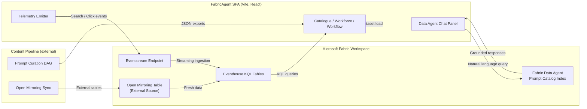

<!--
  FabricAgent Fabric Integrations Overview
  Author: Codex Track
-->

# Fabric Integrations Overview

FabricAgent showcases Microsoft Fabric across three integration pillars—Data Agents, Real-Time Intelligence (RTI), and Open Mirroring. This guide maps how each capability appears in the demo, how it is wired in the repo, and where judges can find reproducibility steps.

## Audience & Scope

- **Audience:** FabCon judges, technical reviewers, and hack teammates who need to validate integrations quickly.
- **Scope:** Frontend touchpoints (FabricAgent), upstream automation maintained outside this repo, and Fabric services the demo references. Operations topics such as deployment are covered separately in `docs/DEPLOYMENT_AZURE.md`.

## Architecture Snapshot

More detail on diagram components lives in `docs/IMPLEMENTATION_SUMMARY.md` and the accompanying pipeline notes referenced in `docs/UPSTREAM_PIPELINE.md`.

## Pillar 1 — Data Agents (Primary Category)

- **Demo Moment:** User asks, “Show prompts for real-time data engineering” inside the FabricAgent chat panel. Follow-up: “Filter to ones with Power BI governance.” Responses cite prompt titles, descriptions, and provenance.
- **Implementation Highlights:**
  - Frontend hook `src/hooks/useDataAgent.ts` orchestrates prompt context and conversation state.
  - `src/services/dataAgent.ts` calls the Fabric Data Agent endpoint defined in `src/config.ts`.
  - Prompt catalog is staged in OneLake as a Delta table via the internal content pipeline, giving the agent structured grounding data.
- **Reproduce It:**
  - Provision a Fabric Data Agent with a knowledge base built from the prompt catalog export (`src/prompt-catalog.json` or your lakehouse Delta table).
  - Publish the catalog to OneLake and register it with the agent using your internal pipeline automation (see `docs/UPSTREAM_PIPELINE.md` for guidance).
  - Copy the agent endpoint + key into `.env.local` with the `VITE_DATA_AGENT_ENDPOINT` variables described in `docs/APP_SETTINGS.md`.
- **Judge Callouts:** Mention “Microsoft Fabric Data Agents” explicitly in narration (see `docs/DEMO_NARRATION.md`), and keep a fallback keyword search ready in case of service degradation.

## Pillar 2 — Real-Time Intelligence (Secondary Category)

- **Demo Moment:** After triggering prompt searches, the live RTI dashboard shows spikes in “Top Searches (last 15 minutes)” and “Most Opened Prompts.” Narration highlights Eventstream ingestion plus Eventhouse analytics.
- **Implementation Highlights:**
  - UI component `src/components/RTIDashboard.tsx` polls RTI metrics on a 5-second cadence.
  - `src/services/telemetry.ts` buffers client events and posts to `VITE_EVENTSTREAM_ENDPOINT`.
  - Eventstream routes data into Eventhouse tables; the KQL used in the demo lives in `FabricAgent/docs/FABRIC_RTI_INTEGRATION.md`.
- **Reproduce It:**
  - Stand up Eventstream + Eventhouse using the playbook in `FabricAgent/docs/FABRIC_RTI_INTEGRATION.md` (schema, KQL, dashboard screenshots).
  - Optional Power BI streaming visual pulls from Eventhouse and can be embedded in-app.
  - Optionally run the synthetic telemetry helper described in `docs/FABRIC_RTI_INTEGRATION.md` to guarantee demo-friendly spikes.
- **Judge Callouts:** Keep a KQL query screenshot ready; judges want to see the Fabric control plane as part of the story.

## Pillar 3 — Open Mirroring (Tertiary Category)

- **Demo Moment:** Narration points to prompts sourced from an external governance wiki mirrored into OneLake. The Workflow section references mirrored runbooks feeding the DAG.
- **Implementation Highlights:**
  - Open Mirroring pulls nightly from SharePoint + Azure SQL, landing in OneLake tables consumed by the curation pipeline.
  - `docs/MIRRORING_SETUP.md` records connector steps and retention policies.
  - `src/dag.json` flags nodes that originated from mirrored sources via the `source: "mirrored"` attribute.
- **Reproduce It:**
  - Follow the mirroring setup doc to connect external datasets into OneLake.
  - Run your internal curation pipeline (see `docs/UPSTREAM_PIPELINE.md`) to propagate metadata into the frontend JSON.
- **Judge Callouts:** Stress the governance angle—mirroring keeps enterprise knowledge current without manual exports, reinforcing the Fabric-native narrative.

## Submission Kit Checklist

| Asset | Location | What Judges See |
| --- | --- | --- |
| Data Agent setup guide | `FabricAgent/docs/FABRIC_INTEGRATIONS.md` (this file) + `docs/UPSTREAM_PIPELINE.md` | Authoritative instructions |
| RTI integration guide | `FabricAgent/docs/FABRIC_RTI_INTEGRATION.md` | KQL, dashboards, fail-safes |
| Mirroring setup | `docs/MIRRORING_SETUP.md` | External data provenance |
| Demo narration cues | `FabricAgent/docs/DEMO_NARRATION.md` | Script annotated to call out Fabric services |
| Validation scripts | `verify_fabricagent.sh`, `validate_publication_readiness.sh` | Confidence before submission |

## Help & Support Surface

The in-app Help center (`src/public/help/index.html`) links directly to this guide so Fabric users can self-serve. Ensure environment variables `VITE_HELP_CENTER_URL` or `VITE_HELP_URL` point to a location hosting these docs (default: GitHub raw view).

## Next Steps & Ownership

- **Codex Track:** keep this page current whenever integration endpoints or demo sequences change.
- **Gemini Track:** co-own schema docs and automation scripts referenced here.
- **Human Track:** validate narration + captions align with the Integration storyline.

Run `./verify_fabricagent.sh` after every structural change to ensure telemetry and chat components compile without regression.
