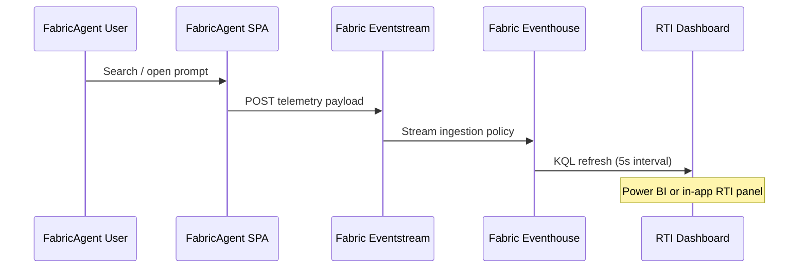

# Fabric Real-Time Intelligence Integration Playbook

This playbook documents how FabricAgent instruments usage telemetry with Microsoft Fabric Real-Time Intelligence (Eventstream + Eventhouse) so judges can replay the demo scenario and verify the data flow.

## Overview

- **Goal:** Capture prompt searches, card views, and workflow interactions from FabricAgent, land them in Eventhouse within seconds, and surface them in a lightweight dashboard that refreshes during the demo.
- **Primary Audience:** FabCon judges and operators validating the RTI narrative.
- **Related Assets:** `FabricAgent/docs/FABRIC_INTEGRATIONS.md`, `docs/APP_SETTINGS.md`, `FabricAgent/docs/DEMO_NARRATION.md`.

## Architecture



## Required Resources

1. Fabric workspace with Eventstream and Eventhouse enabled.
2. Service principal or user with permission to create Eventstream input, output, and KQL database artifacts.
3. `VITE_EVENTSTREAM_ENDPOINT` and `VITE_EVENTSTREAM_KEY` values placed in `FabricAgent/.env.local`.

## Step-by-Step Setup

1. **Create Eventhouse Database**
   - In the Fabric workspace, create an Eventhouse database named `FabricAgentRTI`.
   - Enable ingestion by setting the database to “Streaming optimized”.

2. **Create Eventstream**
   - Add a new Eventstream named `fabricagent-telemetry`.
   - Configure an HTTP input called `fabricagent-ui`.
   - Create an Eventhouse output connecting to `FabricAgentRTI` with table name `PromptTelemetry`.

3. **Define Schema Mapping**
   - Use the following schema when configuring the Eventhouse output:

     | Column | Type | Description |
     | --- | --- | --- |
     | `timestamp` | `datetime` | Client-side ISO timestamp |
     | `eventType` | `string` | `search`, `prompt_open`, `workflow_interaction` |
     | `detail` | `dynamic` | JSON payload with context |
     | `sessionId` | `string` | Anonymous session identifier |

4. **Configure Data Retention**
   - Set hot cache retention to at least 24 hours for the demo.
   - Enable auto-cleanup for records older than 30 days.

5. **Wire Up FabricAgent**
   - Copy the Eventstream HTTPS endpoint to `.env.local`:
     ```
     VITE_EVENTSTREAM_ENDPOINT="https://<region>.eventstream.fabric.microsoft.com/api/events?stream=fabricagent-telemetry"
     VITE_EVENTSTREAM_KEY="<primary key>"
     ```
   - Restart the Vite dev server or redeploy Azure Static Web Apps after updating environment variables.

6. **Validate Locally**
   - Run `npm run dev` in `FabricAgent/`.
   - Trigger several searches and prompt opens.
   - Confirm records appear in Eventhouse using the KQL queries below.

## KQL Cheat Sheet

```kql
-- Recent activity (last 15 minutes)
PromptTelemetry
| where timestamp > ago(15m)
| summarize totalEvents = count(), uniqueSessions = dcount(sessionId) by eventType
| order by totalEvents desc;

-- Top searches (rolling hour)
PromptTelemetry
| where eventType == "search" and timestamp > ago(1h)
| extend query = tostring(detail.query)
| summarize searchCount = count() by query
| top 10 by searchCount;

-- Prompt engagement (24h)
PromptTelemetry
| where eventType == "prompt_open" and timestamp > ago(24h)
| extend promptId = tostring(detail.promptId)
| summarize opens = count(), viewers = dcount(sessionId) by promptId
| top 10 by opens;
```

## Demo Dashboard

- Power BI (or the in-app React panel) refreshes every 5 seconds, executing the KQL statements above.
- Showcase two visuals:
  1. **Column chart:** Top prompt searches (label axes clearly).
  2. **Card visual:** Total unique viewers in the last hour.
- Include a text box stating “Realtime metrics powered by Microsoft Fabric Eventstream + Eventhouse.”

## Synthetic Load for Recording

- Use the curl helper below to emit sample events if the demo environment is quiet:
  ```bash
  curl -X POST "$VITE_EVENTSTREAM_ENDPOINT" \
    -H "Content-Type: application/json" \
    -H "Authorization: $VITE_EVENTSTREAM_KEY" \
    -d '[
      {"timestamp":"2025-11-04T02:45:00Z","eventType":"search","detail":{"query":"data governance"},"sessionId":"seed-001"},
      {"timestamp":"2025-11-04T02:45:02Z","eventType":"prompt_open","detail":{"promptId":"giac-real-time-kql"},"sessionId":"seed-001"},
      {"timestamp":"2025-11-04T02:45:05Z","eventType":"search","detail":{"query":"power bi rollout"},"sessionId":"seed-002"}
    ]'
  ```
- Repeat the command with varied payloads to create realistic distributions (search, prompt_open, workflow_interaction).

## Troubleshooting

- **No events arriving:** Recheck the Eventstream key and confirm CORS allows browser origins.
- **Latency >5 seconds:** Reduce dashboard visuals and ensure Eventhouse database is in the same region as the Eventstream.
- **HTTP 401 from browser:** Regenerate Eventstream keys; update Azure Static Web Apps secrets if running in production.

## Maintenance Checklist

- Rotate Eventstream keys monthly; update `.env` secrets accordingly.
- Use Eventhouse purge policies to keep storage costs predictable.
- Document any schema change in both this playbook and `FabricAgent/docs/FABRIC_INTEGRATIONS.md`.

## Demo Narration Cue

During the video, call out: “Every search we just performed is streaming through Microsoft Fabric Eventstream into Eventhouse, and this dashboard refresh proves the telemetry path in real time.” This aligns with the RTI judging rubric.
