# FabricAgent React Application

<div align="center">
  
  <h1>FabricAgent Prompt Explorer</h1>
  <p><em>Modern React-based interface for Microsoft Fabric & Power BI AI prompt management</em></p>
</div>

## 🎨 Branding Assets

This application includes comprehensive branding assets located in `public/assets/`:

### Logos

- `fabricagent-logo.svg` - Primary logo (SVG format, scalable)
- `fabricagent-logo.png` - Primary logo (PNG format)
- `favicon.ico` - Browser favicon

### Icons

- `badge-power-query.svg` - Power Query badge icon
- `badge-power-query.png` - Power Query badge icon (PNG)

### Illustrations

- `prompt-engineering-concept.svg` - Conceptual illustration for prompt engineering
- `power-bi-ai-agent-workflow-dag.png` - Workflow diagram illustration

## 🚀 Getting Started

### Prerequisites

- Node.js (v16 or higher)
- npm or yarn

### Installation

1. **Install dependencies:**

   ```bash
   npm install
   ```

2. **Set up environment variables:**
   - Copy `.env.local` and set your `GEMINI_API_KEY`

   ```bash
   GEMINI_API_KEY=your_api_key_here
   ```

3. **Update data files:**

   ```bash
   # Copy latest data from the main project
   cp ../prompts/powerbi/prompt-catalog.json ./
   cp ../prompts/workforce/workforce_prompts.json ./
   cp ../prompts/workforce/dag.json ./
   ```

4. **Start development server:**

   ```bash
   npm run dev
   ```

5. **Open your browser:**
   - Navigate to `http://localhost:5173/`

## 🏗️ Build for Production

```bash
npm run build
npm run preview
```

## 🎨 Design System

### Color Palette

- **Primary**: `#0078d4` (Microsoft Fabric Blue)
- **Secondary**: `#106ebe` (Darker Fabric Blue)
- **Accent**: `#f2c811` (Power BI Yellow)
- **Success**: `#107c10`
- **Warning**: `#ff8c00`
- **Error**: `#d13438`

### Typography

- **Primary Font**: Inter (Google Fonts)
- **Fallback**: -apple-system, BlinkMacSystemFont, 'Segoe UI', 'Roboto', sans-serif

### Brand Classes

Custom CSS classes available in `index.css`:

- `.fabric-primary` - Primary brand color
- `.fabric-gradient` - Brand gradient background
- `.logo-hover` - Logo hover animation
- `.fabric-slide-in` - Brand entrance animation
- `.brand-pulse` - Subtle pulsing animation

## 📱 Features

### Core Functionality

- **Catalogue Browser** - Explore curated Power BI prompts
- **Workforce Manager** - Manage workforce-specific prompts
- **DAG Visualizer** - Interactive workflow visualization
- **AI Chat Integration** - Gemini-powered assistance
- **Responsive Design** - Mobile-first approach

### Branding Integration

- **Consistent Visual Identity** - FabricAgent logo throughout
- **Microsoft Brand Alignment** - Colors matching Fabric/Power BI
- **Accessible Design** - High contrast and reduced motion support
- **Professional Aesthetics** - Enterprise-ready appearance

## 🔧 Customization

### Adding New Assets

1. Place new assets in `public/assets/` following the folder structure
2. Update component imports as needed
3. Add appropriate alt text for accessibility

### Modifying Brand Colors

1. Update CSS variables in `index.css`
2. Modify Tailwind config in `index.html` if needed
3. Test in both light and high contrast modes

## 📋 Component Structure

```
src/
├── components/
│   ├── chat/          # AI chat components
│   ├── graph/         # DAG visualization
│   ├── layout/        # Header, Footer (with branding)
│   ├── sections/      # Main content sections
│   ├── tables/        # Data table components
│   └── ui/            # Reusable UI components
├── hooks/             # React hooks
├── services/          # API services
└── types.ts          # TypeScript definitions
```

## 🔗 Integration with Main Project

This React app is designed to work alongside the main FabricAgent project:

- **Data Source**: Uses JSON files generated by `tools/generate_workforce.py`
- **Asset Sharing**: References assets from `../assets/`
- **API Compatibility**: Can connect to Python backend services
- **Build Integration**: Can be built and served alongside the main application

## 🎯 Deployment Options

### Option 1: Standalone

Deploy as a separate React application on platforms like:

- Vercel
- Netlify
- GitHub Pages
- Azure Static Web Apps

### Option 2: Integrated

Build and serve from the main FabricAgent project:

```bash
npm run build
# Copy dist/ contents to main project's web directory
```

### Option 3: Development

Run alongside the main project for development:

```bash
# Terminal 1: Main project
python start_enhanced.py

# Terminal 2: React app
npm run dev
```

## 🛡️ Security Considerations

- **API Keys**: Never commit API keys to version control
- **Environment Variables**: Use `.env.local` for sensitive data
- **CORS**: Configure properly for production deployment
- **Content Security Policy**: Implement for production builds

## 🤝 Contributing

When adding new branding elements:

1. **Follow Brand Guidelines** - Maintain consistency with Microsoft Fabric design
2. **Optimize Assets** - Use SVG for logos, optimize images
3. **Test Accessibility** - Ensure proper contrast ratios and alt text
4. **Document Changes** - Update this README with new assets or patterns

## 📄 License

This project follows the same license as the main FabricAgent project. See the main project's LICENSE file for details.
