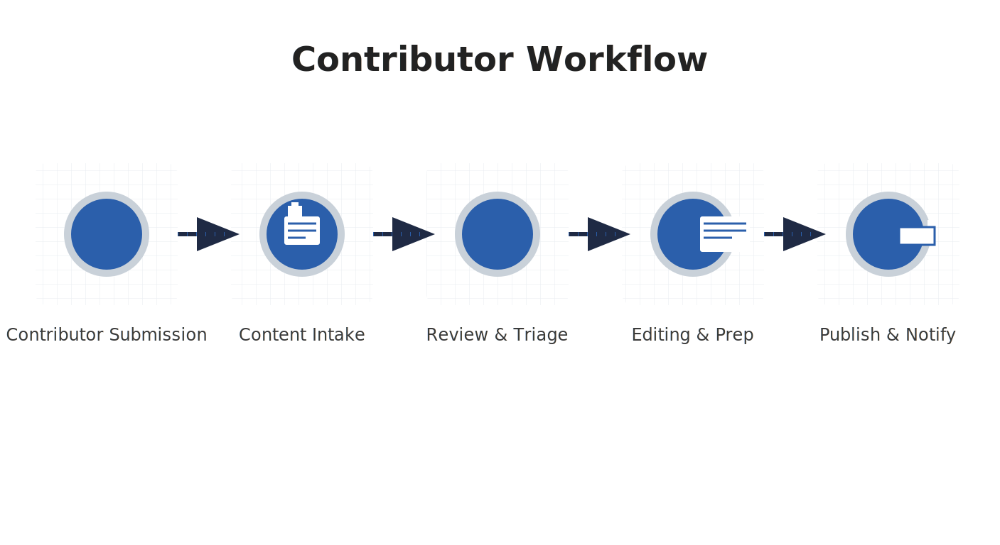
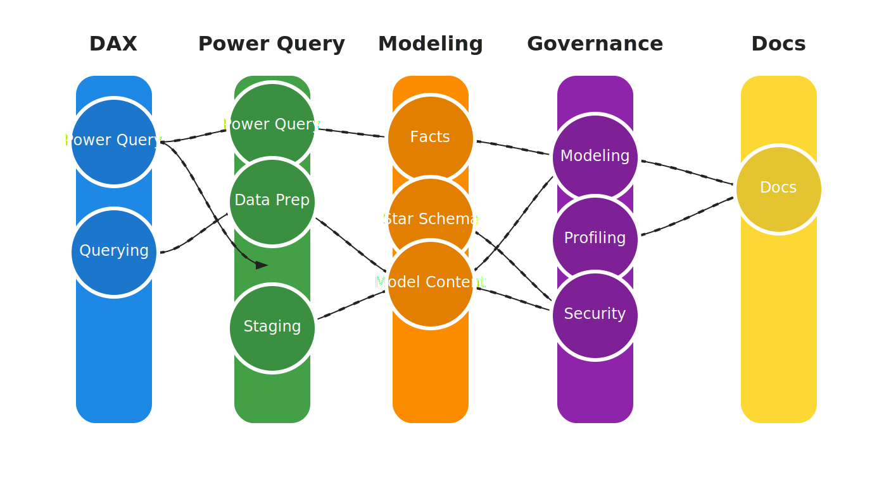

# FabricAgent - FabCon Global Hack 2025 Submission

This repository contains the complete FabCon 2025 hackathon submission for **FabricAgent**.

- **Demo Video:** [YouTube](https://youtu.be/YOUR_VIDEO_ID)
- **Live Demo:** [fabricprompts.com](https://fabricprompts.com)
- **Devpost:** [Submission Page](https://devpost.com/software/fabricagent)

## What's Included
- `FabricAgent/` - React SPA (prompt catalog + Data Agents + RTI + Workflow)
- `specs/` - Spec-kit artifacts (spec.md, plan.md, tasks.md)
- `readme.md` - This file (project overview)

---

## What it does

- Prompt catalog: curated library of Fabric and Power BI prompts, searchable by pillar, topic, and tags.
- Workforce agents: task-specific assistants you can open from a prompt to complete work.
- Conversational help: optional chat to explain prompts and suggest next steps.
- Real-time usage telemetry (optional): track top prompts and search terms to improve content.
- Fabric integrations (optional): Data Agents for conversational query; Eventstream/Eventhouse for telemetry; Open Mirroring for external sources.

---

## Screenshots and architecture

- High-level data flow

  

- Workforce DAG concept

  

---

## Tech stack

| Area     | Tech |
|----------|------|
| Frontend | React + Vite + TypeScript |
| Tests    | Vitest + Playwright |
| Fabric   | Data Agents, Real-Time Intelligence (Eventstream/Eventhouse), Open Mirroring |
| Hosting  | Static web hosting (Azure Static Web Apps or equivalent) |

---

## Quick start (local)

Prereqs

- Node.js 20 LTS
- npm or pnpm
- macOS, Windows, or Linux

Steps

1) Clone

```

git clone [https://github.com/cdrguru/FabricAgent.git](https://github.com/cdrguru/FabricAgent.git)
cd FabricAgent

```

2) Install

```

cd src
npm ci

```

3) Run dev server

```

npm run dev

```

Open <http://localhost:5173> in your browser.

4) Run tests

```

npm test         # Vitest
npm run test:e2e # Playwright, if configured

```

5) Production build

```

npm run build
npm run preview

```

---

## Configuration

- App configs: FabricAgent/src/config.ts and nearby config files.
- Public data and schemas: FabricAgent/src/public/ (prompt catalog, schemas, health endpoints).
- Helpful scripts: `verify_fabricagent.sh`, `validate_publication_readiness.sh` (run from repo root).

---

## How it is organized

Top-level highlights:

- FabricAgent/src: components, hooks, utils, tests, e2e, public assets.
- FabricAgent/docs: deployment, validation, integrations, narration, and pipeline overview.
- specs/hackathon-submission: spec-kit artifacts (feature spec, plan, tasks).

---

## Fabric integrations (optional but strengthens the submission)

Use these to explicitly hit FabCon categories in the demo:

1) Data Agents

- Create a Data Agent linked to a Lakehouse or Warehouse.
- Point it at the prompt catalog and/or usage telemetry for conversational analytics.

2) Real-Time Intelligence

- Emit usage events from the web app (searches, opens, favorites) into Eventstream.
- Route to Eventhouse and build a small dashboard to show real-time top queries and trends.

3) Open Mirroring

- Mirror an external table into OneLake with Open Mirroring to enrich the prompt catalog or telemetry analysis.

---

## Verify (judges and reviewers)

macOS Terminal

1) cd FabricAgent/src && npm ci && npm run dev
2) Open <http://localhost:5173>, use the filter bar, open a prompt card, test search.
3) Run npm test to confirm unit tests pass. Optional: npm run test:e2e for Playwright.

VS Code or Windsurf

1) Open folder FabricAgent/src
2) Terminal: npm ci && npm run dev
3) Use Testing panel to run Vitest; Playwright from its panel if configured. Tests live under src/tests and src/tests-e2e.

---

## Submission kit

Use this section to complete the official checklist:

- [ ] Brief project description and solution overview (above)
- [ ] Link to this GitHub repository
- [ ] 3-5 minute public demo video
- [ ] Confirm FabCon Skills Challenge completion
- [ ] Working link to your project (demo site)
- Video Link: <pending – add YouTube link after recording>

### Judge documentation quick links

- `FabricAgent/docs/FABRIC_INTEGRATIONS.md`
- `FabricAgent/docs/FABRIC_RTI_INTEGRATION.md`
- `FabricAgent/docs/IMPLEMENTATION_SUMMARY.md`
- `FabricAgent/docs/REPRODUCTION.md`
- `FabricAgent/docs/VALIDATION.md`
- `specs/hackathon-submission/` (feature spec, technical plan, task checklist)

---

## Demo video script (3-5 minutes)

1) Hook (10-15s): the problem in one sentence and who it helps.
2) What FabricAgent does (30-45s): catalog, agents, conversational help.
3) Live demo (120-150s): search a task, open a prompt, launch an agent flow; show RTI dashboard spikes; ask a Data Agent a question grounded on your data.
4) Why Fabric features matter (30-45s): call out Data Agents, RTI, Open Mirroring explicitly.
5) Close (10-15s): impact, link to live demo, and where to find the code.

---

## Roadmap to maximize FabCon scoring

Shortlist in the hackathon window:

- Add a Data Agent over the prompt corpus and telemetry (category alignment: AI Features).
- Stream usage into Eventstream -> Eventhouse and visualize a tiny RTI dashboard (category alignment: Real-Time Intelligence).
- Optional: Open Mirroring to pull a lightweight external dataset that enriches the demo story.
- Polish Help and in-app docs; add screenshots and a product thumbnail.

---

## Risks and limits

- Data Agent grounding: ensure your agent is scoped to a small, clear dataset to avoid irrelevant answers.
- RTI demo reliability: pre-load a replay script or synthetic events so the dashboard always updates on camera.
- Mirroring time: if Open Mirroring adds risk to the timeline, stub with a small mirrored table and narrate the extension.

---

## License

MIT (see LICENSE)

---

## Acknowledgments

- Community knowledge sources cited in library/ and knowledge/
- FabCon 2025 organizers and Microsoft Fabric team
